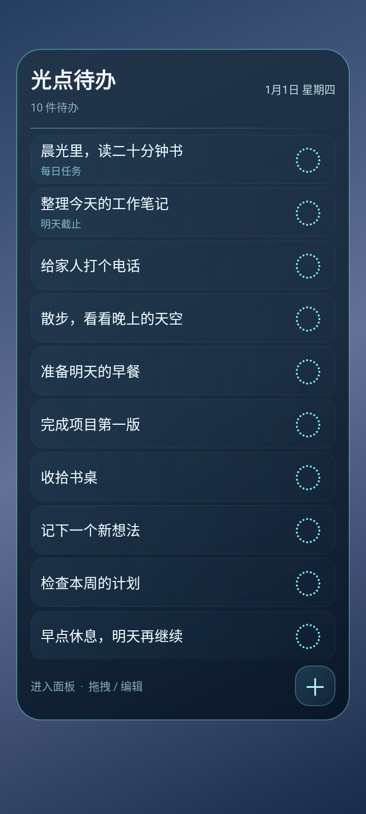

# 光点待办 · vivo-todo-glow

适配 Android 13 及以上的中文本地待办，重点面向 vivo Y36m。2.0.0 使用真正的桌面小组件，保留 vivo 原桌面；任务与编辑页面使用同一份本地数据。

 

两张图片由 Android View 自动测试渲染，任务和日期为模拟环境数据，非 vivo 真机截图。左图是桌面组件布局，右图是应用内任务管理页面。另可查看 [粒子消散阶段图](docs/dissolve-preview.png)。

## 功能

- 深蓝渐变、青白光晕和细腻圆角；右上角显示当天日期和星期。
- 桌面小组件展示排序最前的 10 项，任务保存总数不限。完成普通任务后，下一项自动补入。
- 小组件可调整大小，列表可上下滚动；点击任务编辑，点击“完成”进入应用页面并播放约 0.8 秒光粒子消散。
- 在应用页面按住任务右侧的 `≡` 自由拖动排序；长按任务选择编辑、每日任务、截止日期或删除。
- 在应用页面左滑任务只展示“完成”按钮，点击按钮才执行完成。完成时青白色粒子与柔和光雾散开，后面的任务平滑补位。
- 每日任务完成后暂时隐藏，约 0.8 秒后重新出现在第 5 项；不足 5 项时放在末尾。它可以再次完成。
- 普通任务完成或任何任务删除后有 **5 秒** 独立撤销窗口，超时永久移除。每日任务完成的撤销窗口也是 5 秒，窗口到期只清除撤销入口，不会删除每日任务。
- 截止日期是日期标记，包含今天或逾期状态，不发送定时提醒。
- 无账号、广告、联网权限或云同步。任务只保存在手机内，卸载会清空数据。

## 桌面操作范围

Android 小组件的手势主要是点击和纵向滚动，[官方说明](https://developer.android.com/develop/ui/views/appwidgets/overview#gestures)解释了桌面导航对小组件手势的限制。因此，本版在桌面提供任务列表、日期、新增、编辑入口与撤销；粒子动画、自由拖动任务和长按任务菜单在打开的应用页面中完成。

如需在桌面原地自由拖动任务和播放自绘粒子动画，需要另做支持这些交互的桌面启动器。当前版本继续使用 vivo 原桌面，不替换系统桌面。

## 下载与安装

[2.0.0 下载页](https://github.com/kieslinghengel-ui/vivo-todo-glow/releases/tag/v2.0.0) · [安装包](https://github.com/kieslinghengel-ui/vivo-todo-glow/releases/download/v2.0.0/vivo-todo-glow-2.0.0.apk)

打开应用，点“＋ 添加到桌面”；如果系统未出现添加入口，在桌面空白处长按，进入“组件”或“原子组件”，找到“光点待办”并拖到桌面。详细步骤见 [安装说明](docs/安装说明.md)。

2.0.0 不使用悬浮窗、使用情况访问、通知或无障碍权限。从正式 1.0.0 覆盖安装可保留原任务，不要先卸载。

## 每日任务与撤销

每日任务重新出现时仍是原来的那条任务，不会复制新任务。完成时间、待返回状态和撤销截止时间都会保存在本地，应用进程重启后继续处理。

不同任务有各自的 5 秒窗口。同一每日任务在 5 秒内连续完成多次时，撤销较早的一次也会取消它后面的完成操作；撤销最新一次后，较早的窗口仍可使用。这能恢复原排序位置并避免重复任务。修改任务内容后再撤销完成，会保留已保存的修改。

明确删除每日任务会结束它此前的完成撤销入口，只保留本次删除的 5 秒撤销入口；删除超时后不会自动重新出现。

## 构建

需要 JDK 17、Android SDK platform 35 / build-tools 35.0.0 和网络连接。在本地设置 `ANDROID_HOME`，或在 `local.properties` 中设置 `sdk.dir`。

```powershell
.\gradlew.bat testDebugUnitTest lintDebug assembleDebug
```

```sh
./gradlew testDebugUnitTest lintDebug assembleDebug
```

测试安装包位于 `app/build/outputs/apk/debug/app-debug.apk`。GitHub Actions 自动执行构建、测试和静态检查，并提供测试 APK 与验证报告。

正式版本使用固定的私有签名密钥签署 release APK。仓库与源码 ZIP 不包含签名密钥。CI 的临时 debug 签名不能覆盖正式安装包；后续正式版本必须沿用同一私有密钥，才能稳定升级并保留数据。

## 实现与验证

Kotlin + Android Views；系统 `AppWidgetProvider` / `RemoteViews` 实现桌面小组件，Canvas 实现应用内光粒子效果。Room 保存任务、每日完成事件和撤销截止时间；数据库从版本 1 迁移到版本 2，保留旧任务与尚未到期的撤销记录。

自动测试覆盖排序前 10 项、下一项补入、5 秒撤销边界、重复和并发完成、拖动排序、每日任务第 5 位返回、连续每日完成撤销、数据库关闭重开和旧版本数据迁移。具体结果见 [验证报告](docs/验证报告.md)。

尚未完成 vivo Y36m 真机验证。实际桌面添加入口、组件尺寸、安装升级和粒子流畅度需在手机上确认，见 [验收清单](docs/验收清单.md)。

## 参考与许可

[FloatingOverlay](https://github.com/florinzaicu/FloatingOverlay)、[ExplosionField](https://github.com/tyrantgit/ExplosionField) 和 [Tasks.org](https://github.com/tasks/tasks) 用于方案参考。本项目的任务与粒子实现独立编写，没有复制其源码。依赖及许可说明见 [THIRD_PARTY_NOTICES.md](THIRD_PARTY_NOTICES.md)。项目使用 MIT 许可。
