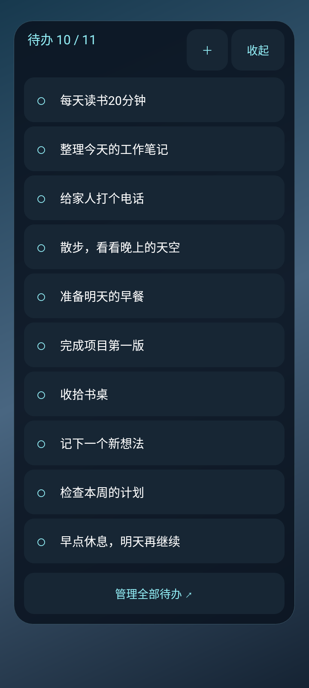

# 光点待办 · vivo-todo-glow

适配 Android 13 及以上的中文本地待办，重点面向 vivo Y36m。保留原系统桌面，通过悬浮窗展示任务。



此图使用实际悬浮面板的 Android View 在720×1600模拟环境中渲染，示例任务为测试数据，非真机截图。

## 功能

- 桌面自动展开半透明深色面板，切换到其他应用后收为悬浮球。
- 前10项待办出现在面板，任务保存总数不限；完成后下一项补入。
- 左滑露出“完成”按钮，点击后播放约0.8秒青白色光粒子消散动画。
- 完成和删除均有 **5秒** 独立撤销窗口，超时永久删除。连续完成多项可分别撤销。
- 添加、编辑、上移、下移、删除；记住面板位置，可调不透明度。
- 锁屏隐藏，通知栏可暂停、恢复和关闭。重启手机后手动重新开启。
- 无账号、云同步、广告、联网权限或定时提醒；任务只保存在本机，卸载清空数据。

## 安装与手机设置

详见 [安装说明](docs/安装说明.md)。首次开启需允许悬浮窗；自动收起还需使用情况访问权限。使用情况访问只读取前台应用包名在本机判断，不保存或上传使用记录。

## 构建

需要 JDK 17、Android SDK platform 35 / build-tools 35.0.0 和网络连接。

```powershell
# 设置 ANDROID_HOME，或在本地 local.properties 中设置 sdk.dir
.\gradlew.bat testDebugUnitTest lintDebug assembleDebug
```

```sh
./gradlew testDebugUnitTest lintDebug assembleDebug
```

APK 在 `app/build/outputs/apk/debug/app-debug.apk`。GitHub Actions 自动构建测试 APK 和验证报告。

正式发行时用私有签名密钥签署 release APK。仓库不存放签名密钥。CI 自动生成的 debug 签名可能随运行变化，不保证不同 CI 产物可覆盖升级；使用同一私有密钥签署的版本才支持稳定升级。

## 实现

Kotlin + Android Views；Room 保存任务和撤销截止时间，DataStore 保存透明度与位置；前台服务托管 `TYPE_APPLICATION_OVERLAY`。亮屏且未锁屏时每秒通过 UsageStatsManager 判断当前应用，并识别默认桌面。未知前台应用时收起；没有使用情况访问权限时可手动操作。

任务完成先持久化移除状态，再播放粒子动画。每条记录独立保留5秒，计时从点击完成并保存时开始，包含动画时间。进程运行期间定期清理，退出期间超时的记录在下次打开时先清理，不能再次撤销。

## 验证

单元测试覆盖数量上限、下一项补入、4.999秒撤销、5秒到期、重复点击、并发完成、独立窗口、重新创建仓库、编辑排序和标题校验；交互测试覆盖左滑不直接完成和纵向滑动。

桌面识别测试覆盖默认桌面解析、前台应用切换和使用情况访问权限拒绝/撤销；磁盘数据库测试覆盖关闭重开后保留截止时间。

真机体验和后台稳定性以 vivo Y36m 实测为准。构建通过、单元测试和模拟环境不能替代真机验证；见 [验收清单](docs/验收清单.md)。

1.0.0 本地14项自动测试及构建已通过；APK签名与对齐检查已通过。详细结果和未验证项见 [验证报告](docs/验证报告.md)。

## 参考与许可

[FloatingOverlay](https://github.com/florinzaicu/FloatingOverlay)、[ExplosionField](https://github.com/tyrantgit/ExplosionField) 和 [Tasks.org](https://github.com/tasks/tasks) 仅用于方案参考。本项目的任务与粒子实现独立编写，没有复制其源码。依赖及许可说明见 [THIRD_PARTY_NOTICES.md](THIRD_PARTY_NOTICES.md)。项目使用 MIT 许可。
